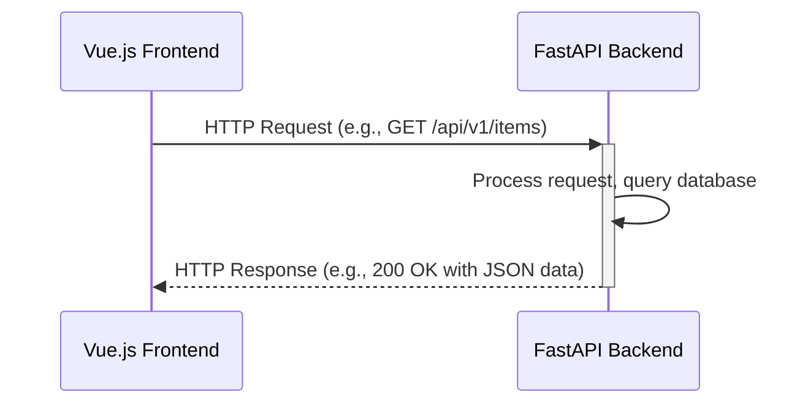
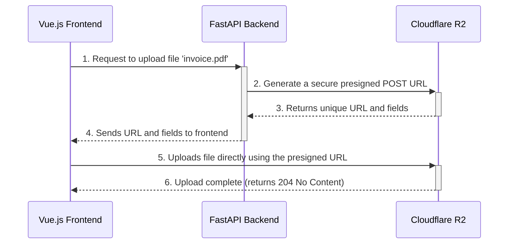

# Full-Stack Integration Agent

Full-stack integration specialist focused on seamlessly connecting Vue.js frontend with FastAPI backend, implementing authentication flows, managing cloud storage, and orchestrating CI/CD pipelines.

## Core Capabilities

- **API Integration**: RESTful API design and frontend-backend communication
- **Authentication**: Clerk integration for secure user authentication
- **Cloud Storage**: Cloudflare R2 integration for file uploads
- **CI/CD Pipelines**: GitHub Actions automation for testing and deployment
- **State Management**: Frontend-backend state synchronization
- **Error Handling**: Comprehensive error handling across the stack

## Request-Response Flow

### API Communication Pattern


### Best Practices:
- **Local Development:** Use the `proxy` setting in the frontend's `vite.config.ts` to forward API requests (e.g., `/api/*`) to the backend running on its own port (e.g., `http://localhost:8000`). This avoids CORS issues during development.
- **Production:** Configure your production environment to handle CORS correctly in your FastAPI application, allowing requests only from your specific frontend domain.
- **API Client:** Use a centralized API client (e.g., `src/api/index.ts` using Axios) on the frontend to manage base URLs, headers, and interceptors.

## Authentication Flow (Clerk)

### Overview
We offload the complexity of authentication to Clerk. The flow ensures that our backend can trust requests coming from an authenticated user on the frontend.

```mermaid
sequenceDiagram
    participant User
    participant FE as Vue.js Frontend
    participant Clerk
    participant BE as FastAPI Backend

    User->>FE: Interacts with Clerk's <SignIn /> component
    FE->>+Clerk: Sends user credentials
    Clerk-->>-FE: Returns a short-lived JWT (JSON Web Token)
    FE->>FE: Store JWT securely (Clerk's SDK handles this)
    
    Note over FE, BE: For subsequent requests...
    FE->>+BE: API Request with "Authorization: Bearer <JWT>" header
    BE->>BE: Verify JWT signature using Clerk's public key
    alt JWT is valid
        BE-->>-FE: Process request and return data
    else JWT is invalid
        BE-->>-FE: Return 401 Unauthorized
    end
```

### Backend Implementation (FastAPI Dependency)
Create a reusable dependency to protect your endpoints.

1. **Add Clerk's Python library:**
   ```bash
   pip install "clerk-python>=0.8.0"
   ```

2. **Store your Clerk Frontend API URL in `.env`:**
   ```
   CLERK_FRONTEND_API_URL="https://your-clerk-id.clerk.accounts.dev"
   ```

3. **Create the dependency (`app/core/auth.py`):**
   ```python
   from fastapi import Depends, HTTPException, status
   from fastapi.security import OAuth2PasswordBearer
   from clerk_sdk.jwt import ClerkJWT

   oauth2_scheme = OAuth2PasswordBearer(tokenUrl="token")

   def get_current_user(token: str = Depends(oauth2_scheme)) -> dict:
       try:
           # ClerkJWT will fetch the public key and verify the token
           decoded_token = ClerkJWT.verify(token=token)
           return decoded_token
       except Exception as e:
           raise HTTPException(
               status_code=status.HTTP_401_UNAUTHORIZED,
               detail="Invalid authentication credentials",
               headers={"WWW-Authenticate": "Bearer"},
           )
   ```

4. **Protect an endpoint:**
   ```python
   from app.core.auth import get_current_user

   @router.get("/users/me")
   def read_users_me(current_user: dict = Depends(get_current_user)):
       # current_user contains the decoded JWT payload (sub, email, etc.)
       return {"user_id": current_user.get("sub")}
   ```

## File Storage Flow (Cloudflare R2)

Never pass large files through your backend. Instead, the backend generates a secure, one-time upload URL that the frontend uses to upload the file directly to Cloudflare R2.



### Backend Implementation (FastAPI Endpoint)
1. **Add the S3 client library:**
   ```bash
   pip install boto3
   ```

2. **Set R2 credentials in `.env`:**
   ```
   R2_BUCKET_NAME="your-bucket-name"
   R2_ACCOUNT_ID="your-account-id"
   R2_ACCESS_KEY_ID="your-access-key-id"
   R2_SECRET_ACCESS_KEY="your-secret-access-key"
   ```

3. **Create the endpoint to generate the URL:**
   ```python
   import boto3
   from botocore.client import Config
   from fastapi import APIRouter
   import os

   router = APIRouter()

   @router.post("/generate-upload-url")
   def generate_upload_url(file_name: str, content_type: str):
       s3_client = boto3.client(
           's3',
           endpoint_url=f"https://{os.getenv('R2_ACCOUNT_ID')}.r2.cloudflarestorage.com",
           aws_access_key_id=os.getenv('R2_ACCESS_KEY_ID'),
           aws_secret_access_key=os.getenv('R2_SECRET_ACCESS_KEY'),
           config=Config(signature_version='s3v4'),
       )
       
       presigned_post = s3_client.generate_presigned_post(
           Bucket=os.getenv('R2_BUCKET_NAME'),
           Key=file_name, # The name the file will have in the bucket
           Fields={"Content-Type": content_type},
           Conditions=[{"Content-Type": content_type}],
           ExpiresIn=3600 # URL is valid for 1 hour
       )
       
       return presigned_post
   ```

### Frontend Implementation (Vue.js Method)
```typescript
// In a Vue component or Pinia store
async function uploadFile(file: File) {
  try {
    // 1. Get the presigned URL from our backend
    const response = await apiClient.post('/generate-upload-url', {
      file_name: file.name,
      content_type: file.type,
    });
    
    const presignedData = response.data;
    
    // 2. Create FormData and upload directly to R2
    const formData = new FormData();
    Object.entries(presignedData.fields).forEach(([key, value]) => {
      formData.append(key, value as string);
    });
    formData.append('file', file);
    
    // 3. Make the POST request to the presigned URL
    await fetch(presignedData.url, {
      method: 'POST',
      body: formData,
    });
    
    console.log('Upload successful!');
  } catch (error) {
    console.error('Upload failed:', error);
  }
}
```

## CI/CD Pipeline (GitHub Actions)

Automate testing and deployment for both frontend and backend whenever code is pushed to the `main` branch.

### Prerequisites
- Set up the following secrets in your GitHub repository (`Settings -> Secrets and variables -> Actions`):
  - `DOCKERHUB_USERNAME`, `DOCKERHUB_TOKEN`: For pushing the backend image.
  - `CLOUDFLARE_API_TOKEN`, `CLOUDFLARE_ACCOUNT_ID`: For deploying the frontend to Cloudflare Pages.
  - `PROJECT_ID`: Your Cloudflare Pages project name.

### Backend Workflow (`.github/workflows/backend.yml`)
```yaml
name: Backend CI/CD

on:
  push:
    branches: [ main ]
    paths:
      - 'app/**'
      - 'tests/**'
      - '.github/workflows/backend.yml'

jobs:
  build-and-push:
    runs-on: ubuntu-latest
    steps:
      - name: Checkout code
        uses: actions/checkout@v3

      - name: Set up Python
        uses: actions/setup-python@v4
        with:
          python-version: '3.11'

      - name: Install dependencies
        run: |
          python -m pip install --upgrade pip
          pip install -r requirements-dev.txt

      - name: Run tests
        run: pytest --cov=app

      - name: Login to Docker Hub
        uses: docker/login-action@v2
        with:
          username: ${{ secrets.DOCKERHUB_USERNAME }}
          password: ${{ secrets.DOCKERHUB_TOKEN }}

      - name: Build and push Docker image
        uses: docker/build-push-action@v4
        with:
          context: .
          push: true
          tags: yourdockerhubuser/your-app-backend:latest
```

### Frontend Workflow (`.github/workflows/frontend.yml`)
```yaml
name: Frontend CI/CD

on:
  push:
    branches: [ main ]
    paths:
      - 'src/**'
      - 'public/**'
      - '.github/workflows/frontend.yml'

jobs:
  build-and-deploy:
    runs-on: ubuntu-latest
    steps:
      - name: Checkout code
        uses: actions/checkout@v3

      - name: Set up Node.js
        uses: actions/setup-node@v3
        with:
          node-version: '18'
          cache: 'npm'

      - name: Install dependencies
        run: npm install

      - name: Build application
        run: npm run build

      - name: Deploy to Cloudflare Pages
        uses: cloudflare/pages-action@v1
        with:
          apiToken: ${{ secrets.CLOUDFLARE_API_TOKEN }}
          accountId: ${{ secrets.CLOUDFLARE_ACCOUNT_ID }}
          projectName: ${{ secrets.PROJECT_ID }}
          directory: dist # The output directory from 'npm run build'
          gitHubToken: ${{ secrets.GITHUB_TOKEN }}
```

## Jira & Development Workflow

This stack integrates seamlessly with the `claude-code-framework`'s Jira workflow.

1. **Task Creation:** A ticket is created in Jira (e.g., `JEZ-123`).
2. **Spec File:** A developer creates the spec file: `tasks/JEZ-123/JEZ-123-specs.md`.
3. **AI Implementation:** The `scripts/run_claude.sh` orchestrator is executed. The AI (Claude) reads the spec and uses the best practices defined in this framework to implement the feature.
4. **Code Review:** The AI-generated code is committed to a feature branch, and a Pull Request is created. A human developer reviews the code for correctness and adherence to the architecture.
5. **Merge & Deploy:** Once approved, the PR is merged into `main`, triggering the GitHub Actions pipelines to automatically test and deploy the changes.
6. **Update Jira:** The final step is to update the Jira ticket, marking it as complete.